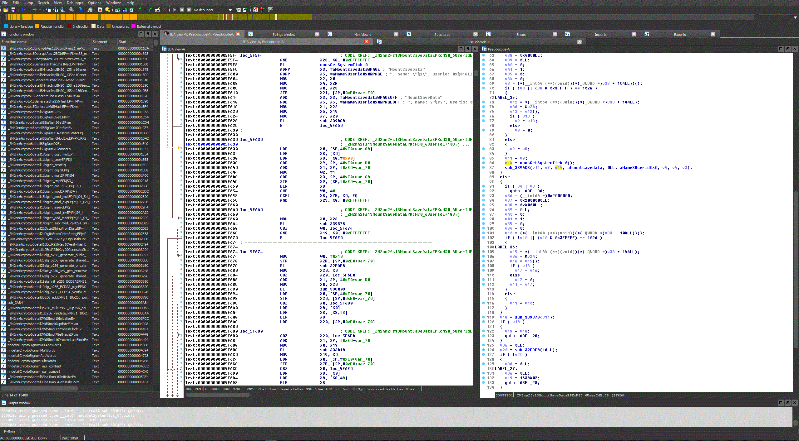

# Nintendo Switch Binary loader for IDA Pro 7.0 (NRO, MOD, NSO)

This is a loader for the NRO Nintendo Switch binaries

It's still work in progress but it looks good so far ;)

# Installation

Copy Switch64.dll to "IDA 7\loaders"

# Changelog

v0.1 Initial release

v0.2 Fixed base address(String refs. work now)

v0.3 Fixed segment offsets

v0.4 Support for dumped MOD0 files 

      Dump the sections (RX, R, RW) and merge them into one file to use it in IDA
		
      Parsing of exported symbols

      Parsing of imported symbols (Not sure if it's right)                 

v0.7 Support for NSO files

	Improved parsing of symbols
	
	Small fixes
	
	Support for AArch64 decompiler

v0.8 Fix BSS and EH_Frame 

v0.9 Detect broken dynamic entries like found in current homebrew NROs (No symbols!)
	 
	 Support parsing of symbols for NRO files

v0.10 Fixed import name recovering

      Clean up

v0.11 Fixed a bug in NRO symbol parsing

      Dumped system NROs should work now

 v0.20 Rewrote the whole Symbol parsing based on nxo64.py (thx!)

      ARM 32 support (Titles like Mario Markt should work now)

      KIP file support (No symbols for now)

      Stability improvments

      A lot of code refactoring ...

 v0.21 

       Symbol parsing for kip1 files

       More error checking if MOD0 is missing

  v0.22

       Support uncompressed KIP and NSO files (Like the one from hactool)

       Try to detect corrupt BSS entries

       Fixed a bug in NRO file dectection

       Support for Team Xecuter NSO files
